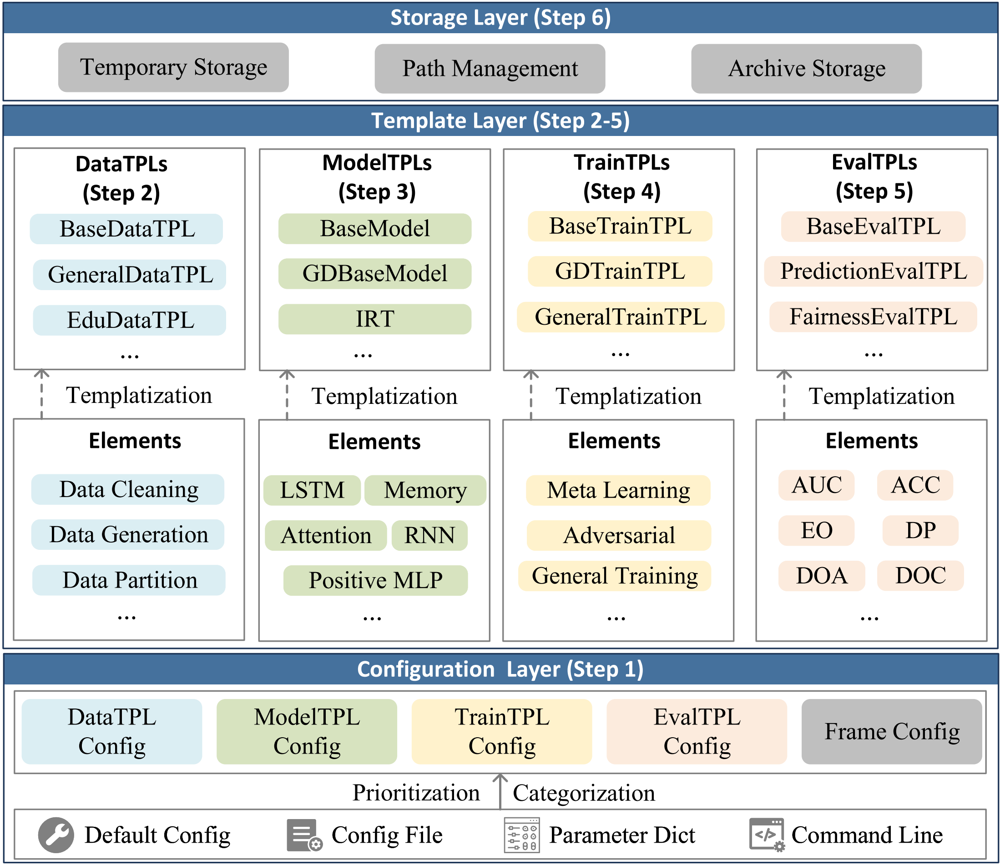

---

<p float="left">


</p>

EduStudio is a Unified Library for Student Cognitive Modeling including Cognitive Diagnosis(CD) and Knowledge Tracing(KT) based on Pytorch.

## Navigation


| Resource Name                                                | Description                                                  |
| ------------------------------------------------------------ | ------------------------------------------------------------ |
| [Eco-Repository](https://github.com/HFUT-LEC/awesome-student-cognitive-modeling) | A  repository containing resources about student cognitive modeling: [papers](https://github.com/HFUT-LEC/awesome-student-cognitive-modeling/tree/main/papers), [datasets](https://github.com/HFUT-LEC/awesome-student-cognitive-modeling/tree/main/datasets), [conferences&journals](https://github.com/HFUT-LEC/awesome-student-cognitive-modeling/tree/main/conferences%26journals) |
| [Eco-Leaderboard](https://leaderboard.edustudio.ai)          | A leaderboard demonstrating performance of implemented models |
| [EduStudio Documentation](https://edustudio.readthedocs.io/) | The document for EduStudio usage                             |
| [Reference Table](https://edustudio.readthedocs.io/en/latest/user_guide/reference_table.html) | The reference table demonstrating the corresponding templates of each model |

## Description

EduStudio first decomposes the general algorithmic workflow into six steps: `configuration reading`, `data prepration`, `model implementation`, `training control`, `model evaluation`, and `Log Storage`. Subsequently, to enhance the `reusability` and `scalability` of each step, we extract the commonalities of each algorithm at each step into individual templates for templatization.

<p align="center">
  
  <br>
  <b>Figure</b>: Overall Architecture of EduStudio
</p>


## Quick Start

Install `EduStudio`:

```bash
pip install -U edustudio
```

Example: Run `NCDM` model:

```python
from edustudio.quickstart import run_edustudio

run_edustudio(
    dataset='FrcSub',
    cfg_file_name=None,
    traintpl_cfg_dict={
        'cls': 'GeneralTrainTPL',
    },
    datatpl_cfg_dict={
        'cls': 'CDInterExtendsQDataTPL'
    },
    modeltpl_cfg_dict={
        'cls': 'NCDM',
    },
    evaltpl_cfg_dict={
        'clses': ['PredictionEvalTPL', 'InterpretabilityEvalTPL'],
    }
)

```

To find out which templates are used for a model, we can find in the [Reference Table](https://edustudio.readthedocs.io/en/latest/user_guide/reference_table.html)

## License

EduStudio uses [MIT License](https://github.com/HFUT-LEC/EduStudio/blob/main/LICENSE). 
