---

<p float="left">


</p>

EduStudio is a Unified and Templatized Framework for Student Assessment Models including Cognitive Diagnosis(CD) and Knowledge Tracing(KT) based on Pytorch.

## Announcement

- We are working hard to reproduce the results presented in their papers for all models. These results will be published later on https://edustudio.ai/.
- We are organizing more comprehensive resources related to student assessment models to build a complete ecosystem for EduStudio.

## Description
EduStudio first decomposes the general algorithmic workflow into five steps: `configuration reading`, `data processing`, `model implementation`, `training control`, and `result evaluation`. Subsequently, to enhance the `reusability `of each step, we extract the commonalities of each algorithm at each step into individual templates for templatization.

As illustrated in the Figure below, to better implement a templatized framework, we implement an `inheritance-style` EduStudio that contains basic architecture and inherited architecture with different responsibilities. The **basic architecture emphasizes domain-irrelevant content and strives to build templatized protocols**. The **inherited architecture obeys the protocol in the basic architecture and focuses on domain-relevant content**. The inheritance-style separates domainrelevant and domain-irrelevant content, greatly simplifying framework structure and enhancing `readability`.

The documentation is available [here](https://edustudio.readthedocs.io).

<p align="center">
  
  <br>
  <b>Figure</b>: Overall Architecture of EduStudio
</p>


## Quick Start

Install `EduStudio`:

```bash
pip install -U edustudio
```

Example: Run `NCDM` model:

```python
from edustudio.quickstart import run_edustudio

run_edustudio(
    dataset='FrcSub',
    cfg_file_name=None,
    traintpl_cfg_dict={
        'cls': 'EduTrainTPL',
    },
    datatpl_cfg_dict={
        'cls': 'CDInterExtendsQDataTPL'
    },
    modeltpl_cfg_dict={
        'cls': 'NCDM',
    },
    evaltpl_cfg_dict={
        'clses': ['BinaryClassificationEvalTPL', 'CognitiveDiagnosisEvalTPL'],
    }
)

```

To find out which templates are used for a model, we can find in the [Reference Table](https://edustudio.readthedocs.io/en/latest/user_guide/reference_table.html)

## License

EduStudio uses [MIT License](https://github.com/HFUT-LEC/EduStudio/blob/main/LICENSE). 

