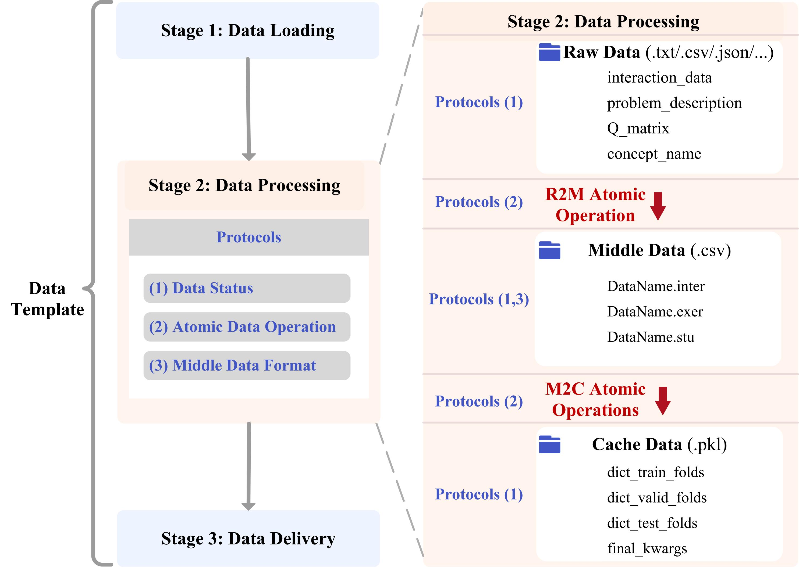

# Standardized Data Module

For data module, we provide a standardized design with three protocols (see following sections for details):
- Data Status Protocol
- Middle Data Format Protocol
- Atomic Operation Protocol

The first step of Data Templates is to load the raw data from the hard disk. Then, a series of processing steps are performed to obtain model-friendly data objects. Finally, these data objects are passed on to other modules.
We simplify the data preparation into three into three stages:

- Data loading: Loading necessary data from the hard disk.
- Data processing: Convert the raw data into model-friendly data objects by a range of data processing operations.
- Data delivery: Deliver model-friendly data objects to the training, model, and evaluation templates.
