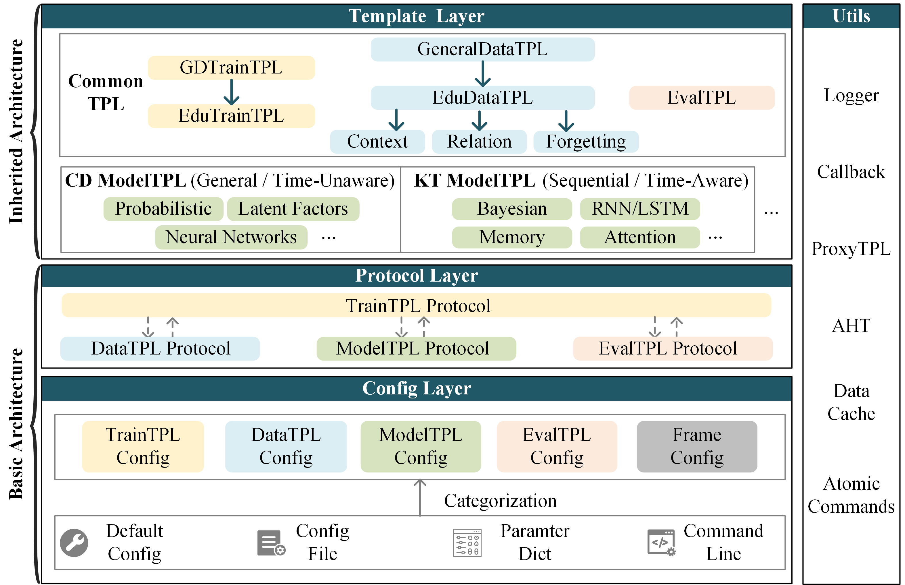

.. EduStudio documentation master file.
.. title:: EduStudio v1.0.0-beta2

=========================================================

`HomePage <https://edustudio.ai/>`_ | `Docs <https://edustudio.ai/docs/>`_ | `GitHub <https://github.com/HFUT-LEC/EduStudio>`_ 

Introduction
-------------------------
EduStudio is a Unified and Templatized Framework for Student Assessment Models including Cognitive Diagnosis(CD) and Knowledge Tracing(KT) based on Pytorch.

EduStudio first decomposes the general algorithmic workflow into five steps: ``configuration reading``, ``data processing``, ``model implementation``, ``training control``, and ``result evaluation``. Subsequently, to enhance the ``reusability`` of each step, we extract the commonalities of each algorithm at each step into individual templates for templatization.

As illustrated in the Figure below, to better implement a templatized framework, we implement an ``inheritance-style`` EduStudio that contains basic architecture and inherited architecture with different responsibilities. 

The **basic architecture emphasizes domain-irrelevant content and strives to build templatized protocols**. 
The **inherited architecture obeys the protocol in the basic architecture and focuses on domain-relevant content**. 
The inheritance-style separates domainrelevant and domain-irrelevant content, greatly simplifying framework structure and enhancing ``readability``.

The overall structure is illustrated as follows:

.. raw:: html

    
   
.. toctree::
   :maxdepth: 1
   :caption: Get Started

   get_started/install
   get_started/quick_start

.. toctree::
   :maxdepth: 1
   :caption: Framework Features

   features/global_cfg_obj
   features/inheritable_config
   features/atomic_files
   features/dataset_folder_protocol
   features/atomic_operations

.. toctree::
   :maxdepth: 1
   :caption: User Guide

   user_guide/datasets
   user_guide/models
   user_guide/reference_table
   user_guide/usage

.. toctree::
   :maxdepth: 1
   :caption: Developer Guide

   developer_guide/customize_atomic_op
   developer_guide/customize_datatpl
   developer_guide/customize_modeltpl
   developer_guide/customize_traintpl
   developer_guide/customize_evaltpl

   
Indices and tables
==================

* :ref:`genindex`
* :ref:`modindex`
* :ref:`search`
