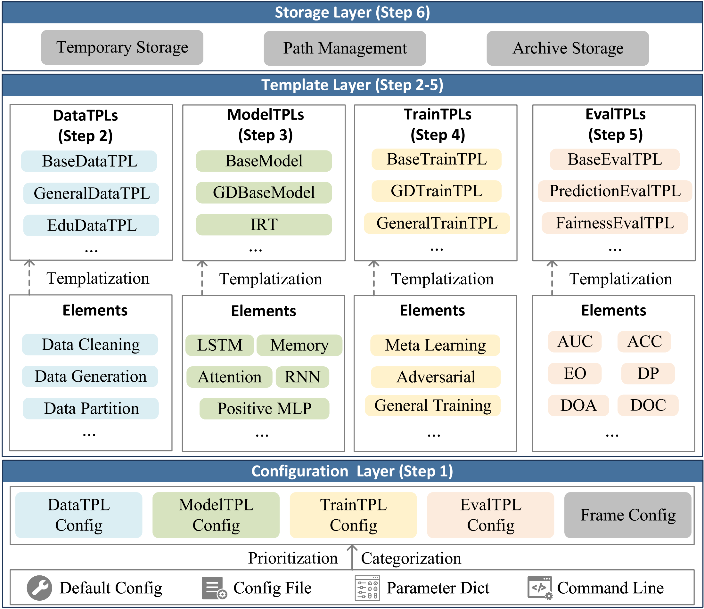

.. EduStudio documentation master file.
.. title:: EduStudio v1.1.6

=========================================================

`HomePage <https://edustudio.ai/>`_ | `Docs <https://edustudio.ai/docs/>`_ | `GitHub <https://github.com/HFUT-LEC/EduStudio>`_ | `Paper <https://journal.hep.com.cn/fcs/EN/10.1007/s11704-024-40372-3>`_ 

Introduction
-------------------------
EduStudio is a Unified Library for Student Assessment Models including Cognitive Diagnosis(CD) and Knowledge Tracing(KT) based on Pytorch.

EduStudio first decomposes the general algorithmic workflow into six steps: `configuration reading`, `data prepration`, `model implementation`, `training control`, `model evaluation`, and `Log Storage`. Subsequently, to enhance the `reusability` and `scalability` of each step, we extract the commonalities of each algorithm at each step into individual templates for templatization.

- Configuration Reading (Step 1) aims to collect, categorize and deliver configurations from different configuration portals. 
- Data Preparation (Step 2) aims to convert raw data from the hard disk into model-friendly data objects. 
- Model Implementation (Step 3) refers to the process of implementing the structure of each model and facilitating the reuse of model components. 
- Training Control (Step 4) focuses primarily on the training methods of various models. 
- Model Evaluation (Step 5) primarily focuses on the implementation of various evaluation metrics. 
- Log Storage (Step 6) aims to implement storage specification when store generated data.

The modularization establishes clear boundaries between various programs in the algorithm pipeline, facilitating the introduction of new content to individual modules and enhancing scalability.

The overall structure is illustrated as follows:

.. raw:: html

    
   
.. toctree::
   :maxdepth: 1
   :caption: Get Started

   get_started/install
   get_started/quick_start

.. toctree::
   :maxdepth: 1
   :caption: Framework Features

   features/global_cfg_obj
   features/inheritable_config
   features/standard_datamodule
   features/dataset_folder_protocol
   features/atomic_files
   features/atomic_operations

.. toctree::
   :maxdepth: 1
   :caption: User Guide

   user_guide/atom_op
   user_guide/datasets
   user_guide/models
   user_guide/reference_table
   user_guide/usage

.. toctree::
   :maxdepth: 1
   :caption: Developer Guide

   developer_guide/customize_atomic_op
   developer_guide/customize_datatpl
   developer_guide/customize_modeltpl
   developer_guide/customize_traintpl
   developer_guide/customize_evaltpl

   
Indices and tables
==================

* :ref:`genindex`
* :ref:`modindex`
* :ref:`search`
